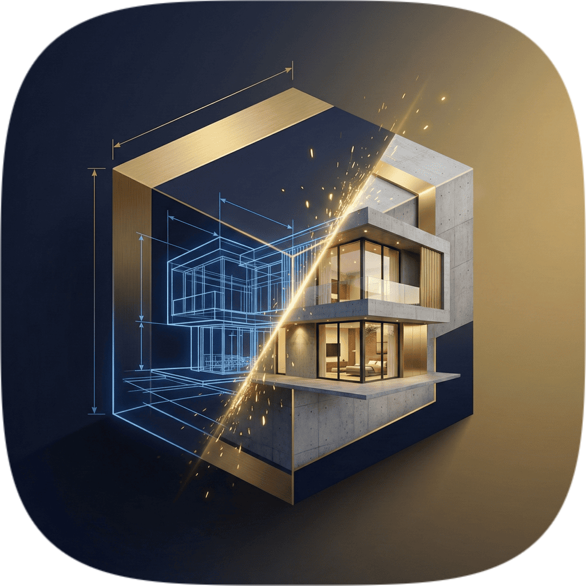
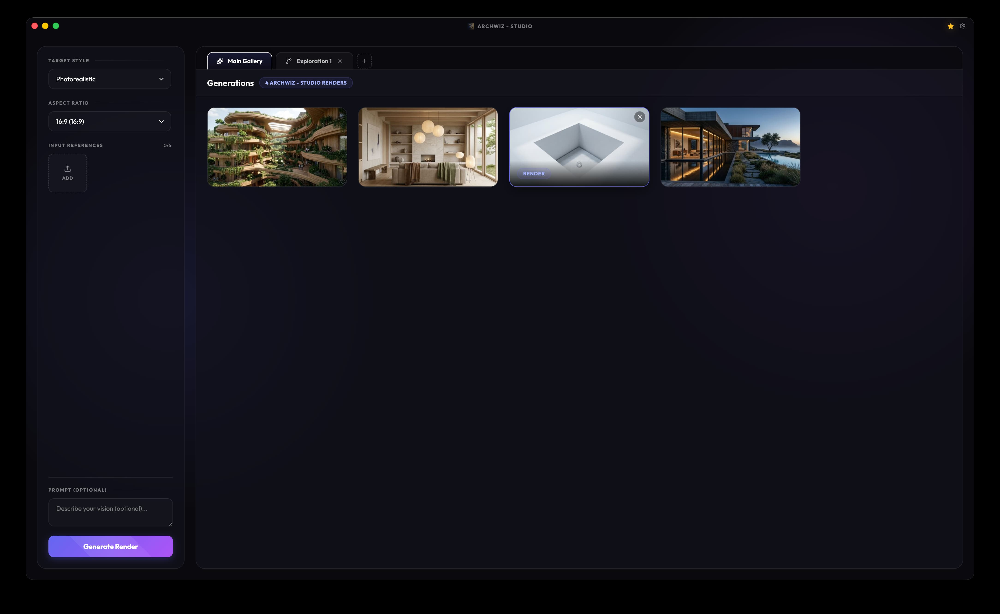
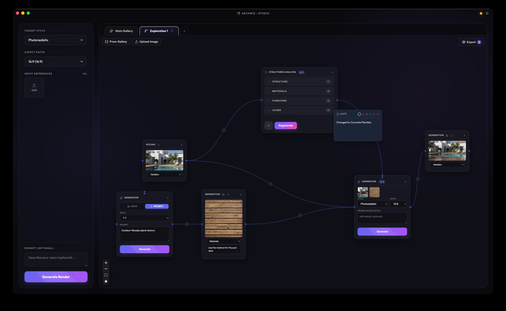
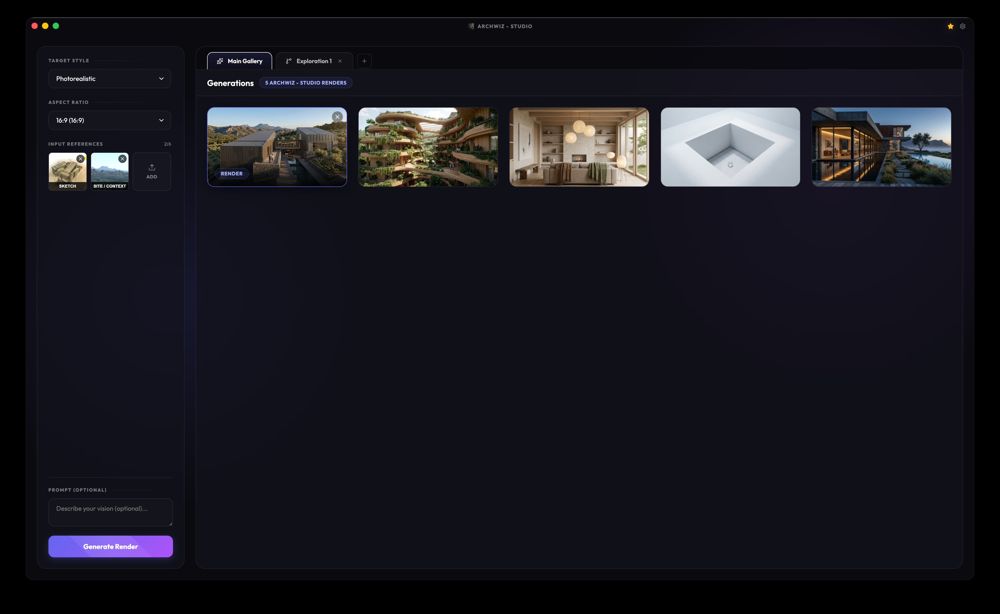

  

<h1 align="center">ArchWiz Studio</h1>

  <strong>The Professional Visualization Kit for Architects and Designers.</strong> 
  Accelerate your workflow with local AI-powered rendering and the power of macOS.

  <a href="https://archwiz.studio">Website</a> •
  <a href="https://archwiz.studio/download">Download</a> •
  <a href="https://github.com/ddutchie/archwiz-studio/issues">Report Bug</a> •
  <a href="https://github.com/ddutchie/archwiz-studio/issues">Request Feature</a>

---

## Overview

ArchWiz Studio is a native macOS application designed to bring the latest AI visualization techniques directly to your desktop. By leveraging Apple Silicon's Neural Engine, ArchWiz provides ultra-fast, local upscaling and variation generation without compromising your privacy or data security.

## Key Features

- **Native CoreML Upscaling**: Harness your Mac's Neural Engine with industry-standard models like UltraSharp and RealESRGAN for 4x local enhancement.
- **Variation Canvas**: Explore design directions with our React Flow node graph. Wire up infinite branching trees of architectural variations.
- **7 Native Reference Modes**: From site context and 3D views to sketches and material references.
- **Architectural Styles**: Over 14+ built-in styles including Photorealistic, Minimalist, Japandi, Biophilic, and more.
- **Secure Cloud Processing**: High-performance architectural generation powered by the cloud, while your renders remain private on your machine.

## Installation

1.  **Download** the latest `ArchWiz-Studio.dmg` from the [Releases](https://github.com/ddutchie/archwiz-studio/releases) page or the [Official Website](https://archwiz.studio/download).
2.  **Open** the DMG and drag **ArchWiz** to your Applications folder.
3.  **Launch** the app and sign in to get started.

> [!NOTE]
> ArchWiz Studio is optimized for Apple Silicon (M1/M2/M3/M4/M5). Intel Macs are supported via Rosetta 2, though local AI performance may vary.

## Community & Support

We want to build the best tool for architects, and your feedback is crucial!

- **Submit a Bug**: If something isn't working right, please [open an issue](https://github.com/ddutchie/archwiz-studio/issues).
- **Feature Requests**: Have an idea for a new feature? [Let us know](https://github.com/ddutchie/archwiz-studio/issues)!
- **Discord / Community**: Join our community to share your renders and get help from other designers.

## Screenshots

  
   
  <em>The main gallery for managing your architectural projects.</em>

  
   
  <em>The Variation Canvas: Node-based design exploration.</em>

  
   
  <em>Deep technical control with native reference modes and styles.</em>

---

&copy; 2026 ArchWiz Studio. Designed for macOS.
